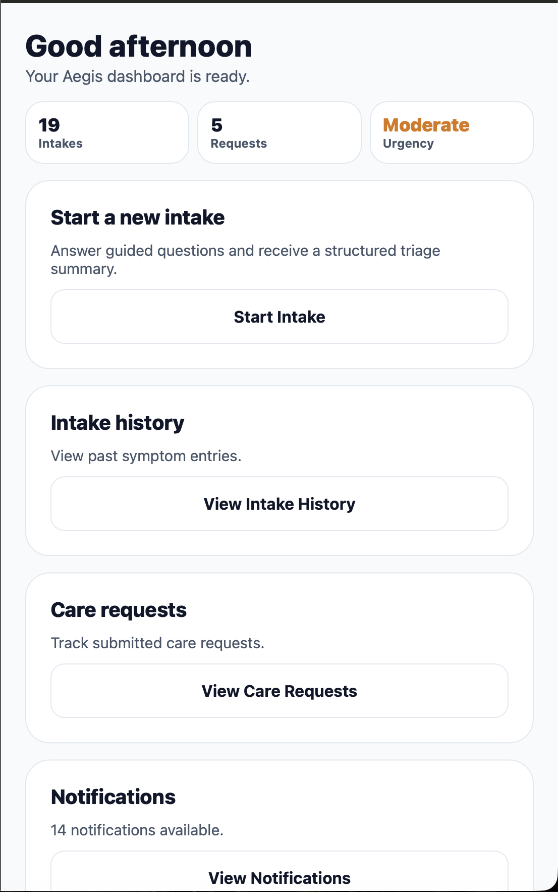
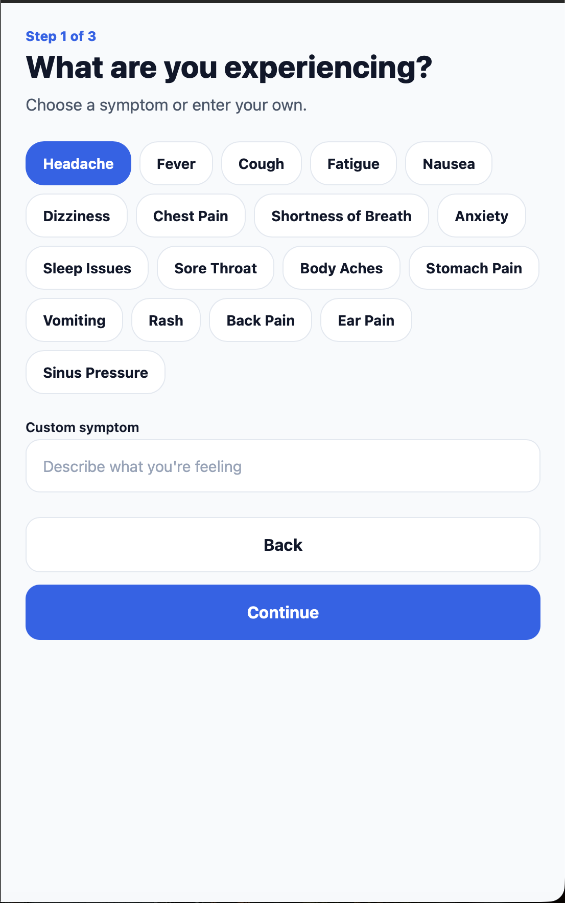
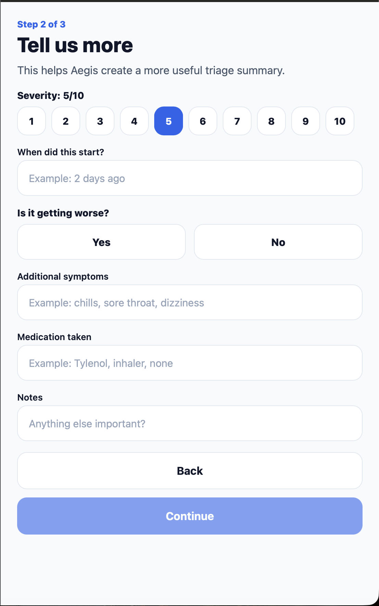
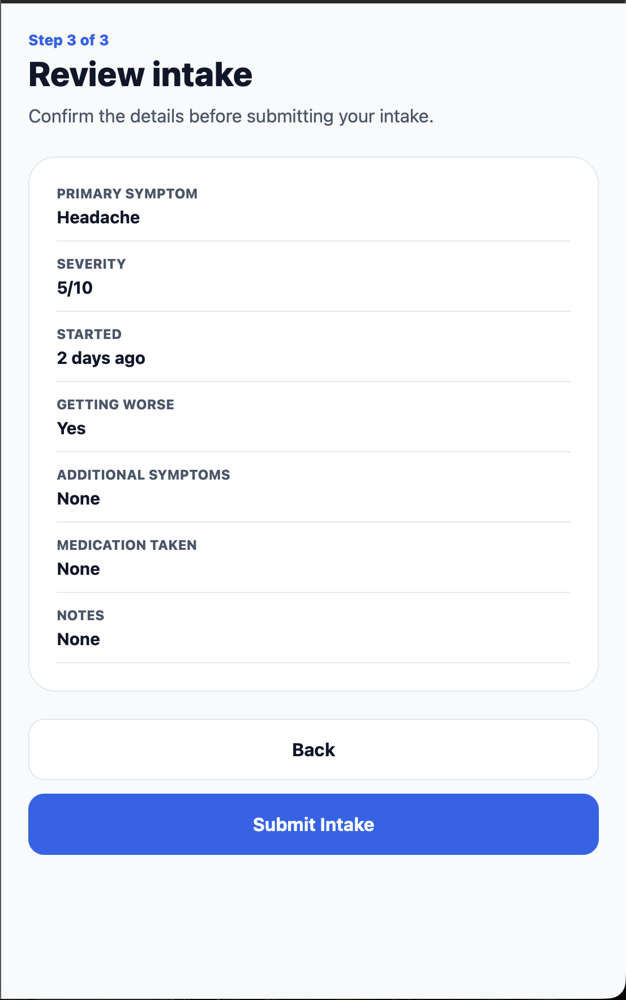
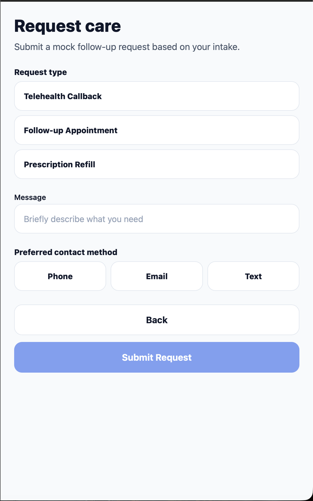
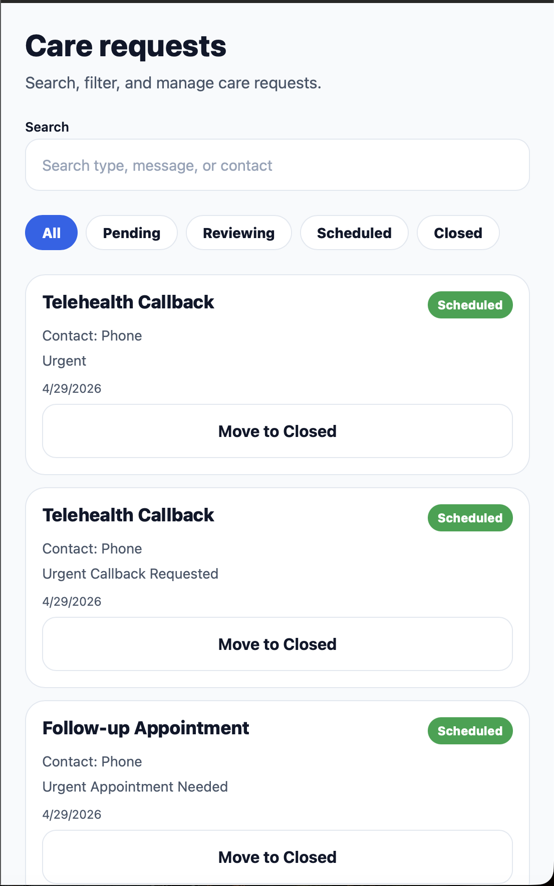
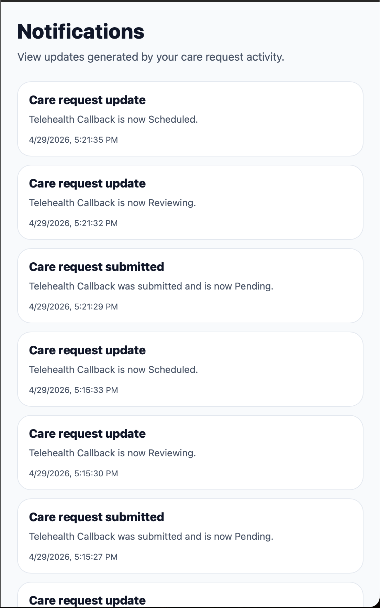
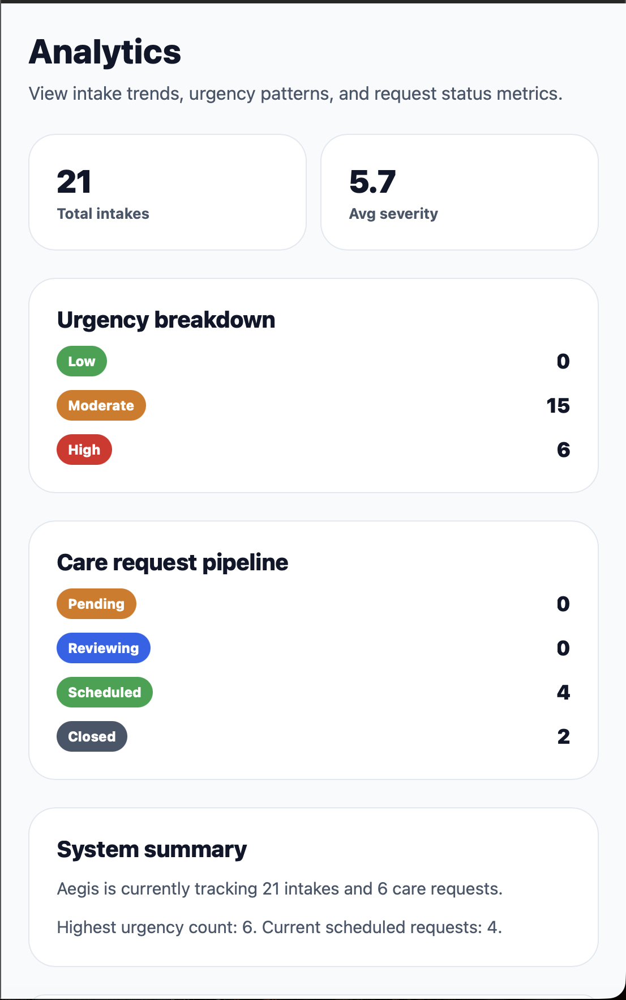

# Aegis

Aegis is a React Native mobile health-intake demo app that guides users through a symptom intake flow, generates a mock triage summary, allows follow-up care requests, tracks request status changes, and displays persistent history, notifications, and analytics.

> Demo project only. Aegis does not provide medical advice.

---

## Overview

Aegis was built as a portfolio-grade mobile application to demonstrate frontend development, state management, local persistence, navigation architecture, reusable components, interactive filtering/search/sorting, and product-focused user flows.

The app simulates a lightweight digital health assistant experience:

1. User logs in or creates an account
2. User completes a guided symptom intake
3. App generates a mock triage result
4. User can submit a care request
5. Request status automatically progresses
6. Notifications are generated
7. Intake history, request history, and analytics are available

---

## Features

### Authentication Flow

- Welcome screen
- Login screen
- Signup screen
- Mock authentication using Zustand state

### Guided Intake Flow

- Intake start screen
- Symptom selection
- Custom symptom input
- Severity selection
- Duration input
- Worsening symptom selection
- Additional symptoms
- Medication taken
- Notes
- Review screen before submission

### Mock Triage Result

- Generates Low, Moderate, or High urgency result
- Dynamic urgency badge
- Summary, concern category, and recommendation
- Medical disclaimer

### Intake History

- Persistent intake history using AsyncStorage
- Search by symptom, duration, notes, and additional symptoms
- Filter by urgency: All, Low, Moderate, High
- Sort by Newest, Oldest, and Severity High
- Colored urgency badges

### Care Requests

- Submit mock care request after intake
- Request type selection
- Contact method selection
- Message input
- Loading/submitting state
- Success confirmation screen
- Persistent care request history

### Care Request Status System

- Request statuses:
  - Pending
  - Reviewing
  - Scheduled
  - Closed
- Manual status updates
- Automatic mock progression:
  - Pending
  - Reviewing
  - Scheduled

### Notifications

- Notifications are created when:
  - Care request is submitted
  - Care request status changes
- Persistent notification history
- Clear notifications option

### Analytics

- Total intakes
- Average severity
- Urgency breakdown
- Care request pipeline
- System summary

### Dashboard

- Animated dashboard load
- Intake count
- Request count
- Latest urgency stat
- Navigation cards for major app sections

---

## Tech Stack

- React Native
- Expo
- TypeScript
- React Navigation
- Zustand
- AsyncStorage
- React Native Animated API

---

## Project Structure

```text
src/
  api/
  components/
    AppButton.tsx
    AppInput.tsx
    ScreenContainer.tsx
    StatusBadge.tsx

  constants/
    theme.ts

  navigation/
    RootNavigator.tsx

  screens/
    analytics/
      AnalyticsScreen.tsx

    auth/
      LoginScreen.tsx
      SignupScreen.tsx
      WelcomeScreen.tsx

    care/
      CareRequestHistoryScreen.tsx
      CareRequestScreen.tsx
      CareRequestSuccessScreen.tsx

    history/
      HistoryScreen.tsx

    home/
      HomeScreen.tsx

    intake/
      IntakeQuestionsScreen.tsx
      IntakeResultScreen.tsx
      IntakeReviewScreen.tsx
      IntakeStartScreen.tsx
      SymptomSelectScreen.tsx

    notifications/
      NotificationsScreen.tsx

    profile/
      ProfileScreen.tsx

  store/
    authStore.ts
    careRequestStore.ts
    intakeStore.ts
    notificationStore.ts

  types/
    triage.ts

  utils/
    triage.ts
```

---

## Screenshots

### Dashboard

The dashboard gives users a quick overview of intake count, care requests, latest urgency level, notifications, and analytics access.



---

### Intake Step 1 — Symptom Selection

Users can select a common symptom or enter a custom symptom.



---

### Intake Step 2 — Symptom Details

Users provide severity, symptom duration, worsening status, additional symptoms, medication taken, and notes.



---

### Intake Review

Before submitting, users can review the full intake summary.



---

### Care Request Form

Users can submit a mock follow-up care request with request type, message, and preferred contact method.



---

### Care Request Pipeline

Submitted requests move through a mock workflow with searchable and filterable statuses.



---

### Notifications

The app generates persistent notifications when care requests are submitted or updated.



---

### Analytics

The analytics screen shows intake totals, average severity, urgency breakdown, care request pipeline, and system summary.


